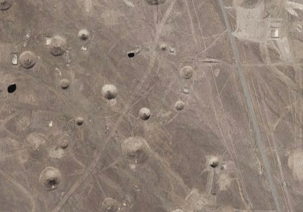
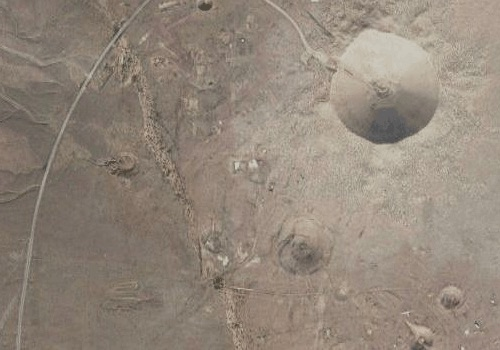
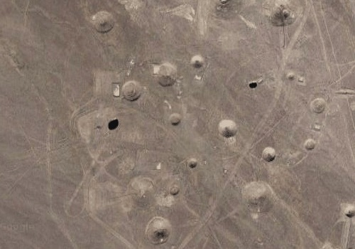

# Crater-Scraper / Crater Classification

Identifying Craters left from wepons test using Convolutional Neural
Network.

Crater Scraping is an ongoing research project that seeks to train a
Convolutional Neural Network to identify and classify nuclear weapons
test sites. Crater Scraping works by utilizing information from FOIA
requests and research from military historians to scrape satellite
imagery of weapons test sites. Images are then used to train a Neural
Network to identify and classify man made geological events from
satellite imagery.







-----------------------------------

Installation:

1. Install dlib, scikit-image and tensorflow.

2. Install the node prerequisites and create a directory to hold
   images:
    ```
    cd scripts/node
    npm install googlemaps easyimage fast-csv turf @turf/invariant
    mkdir -p ../../images/crater ../../images/no_crater
    ```

3. Generate a Google Static Maps API key by going to
   the
   [Google Static Maps API page](https://developers.google.com/maps/documentation/static-maps/) and
   clicking the "GET KEY" button. Put the key in
   `scripts/node/config.js`.

3. Run scraper.js to gather nuclear test site images:
    ```
    node scraper.js
    ```

    This should take about 10 minutes to collect approximately 2000
    images.

4. Run random_scraper.js to gather satellite imagery of random places.

5. Convert the PNG images to JPG:

    ```
    cd images/crater
    find . -type f -print0 | xargs -0 -n 1 -P 6 -I {} sh -c "gm convert {} -quality 90 {}.jpg && rm {}"
    cd images/no_crater
    find . -type f -print0 | xargs -0 -n 1 -P 6 -I {} sh -c "gm convert {} -quality 90 {}.jpg && rm {}"
    ```

5. Train the model:
    ```
    python ~/tensorflow/tensorflow/examples/image_retraining/retrain.py \
      --how_many_training_steps 4000 \
      --output_graph=crater_graph.pb \
      --output_labels=crater_labels.txt \
      --image_dir=images
    ```

5. Run the classifier on a new image:
    ```
    $ ~/tensorflow/bazel-bin/tensorflow/examples/label_image/label_image \
      --graph=crater_graph.pb \
      --labels=crater_labels.txt \
      --output_layer=final_result \
      --image=1.jpg \
      --input_layer=Mul
    2017-04-05 15:58:38.495479: I tensorflow/examples/label_image/main.cc:206] crater (1): 0.938558
    2017-04-05 15:58:38.495497: I tensorflow/examples/label_image/main.cc:206] no crater (0): 0.0614419
    ```

-----------------------------------

* 11/23/2016 - Script to collect a google map of crater site and save as cropped image.
* 11/24/2016 - Script to convert crater images into Histogram of Oriented Gradients.
* 11/25/2016 - Compiled CSVs of nuclear tests and coordinates
* 11/26/2016 - Gathered all images...around 2000
* 12/3/2016 - Convolution with Tensorflow
* 12/5/2016 - Neural Net with tensor flow
* 12/7/2016 - retrain.py to train the final layer of a pretrained inception model
* 12/9/2016 - classifying images

## Current status

This works to identify craters with better than average results.
However, it is easy to fool if you feed an image of a desert to the
network. Still is valuable code if all you want to do is scrape all
2000 images.

Thanks to johnston archives.

http://www.johnstonsarchive.net/nuclear/tests/
